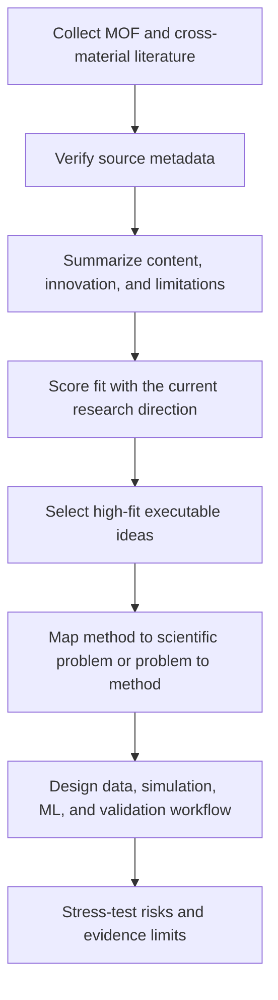

# Literature Search Summary

## Overview

Use the local `literature_tool` project to collect recent MOF/COF papers or cross-material ML-method papers, deduplicate them, tag themes and methods, and write a concise literature brief or research-radar triage. Prefer the built-in rule-based summarization path and keep `--use-openai` off unless the user explicitly asks for it and an API key is already configured.

Default research-radar output should prioritize fit, significance, and feasibility over short-term novelty. If a weekly or biweekly scan returns little that is genuinely relevant, say so plainly instead of forcing a novelty narrative.

For MOF/COF domain tracking, use `mof_latest`, `mof_adsorption`, `mof_catalysis`, or `cof_transfer_methods`. For method scouting beyond MOFs, use `materials_ml_transfer`; it intentionally allows non-MOF papers, prioritizes concrete transferable ML methods and high-impact venue families, and reports whether the method looks already absorbed by recent MOF work or still offers a fresh MOF opportunity. For older MOF adoption checks, use `mof_ml_method_prior_art` as a long-horizon baseline before calling a method new to MOFs.

## Core Workflow

1. Locate the repository root.
   Look for `run.py`, `core.py`, `profiles.py`, and `configs/`. If the repository is not present in the current workspace, stop and explain the missing dependency instead of improvising a new search stack.
2. Choose the lightest execution path that matches the request.
   Use a one-off CLI run for ad hoc searches, a JSON config for repeatable runs, and Codex automations for recurring research-radar jobs. Treat the PowerShell helpers as legacy/manual compatibility unless the user specifically wants Windows task scheduling.
3. Prefer the bundled wrapper script for execution.
   Run `python <skill-dir>/scripts/run_literature_tool.py --repo <repo-root> ...` so repository detection and relative-path resolution stay consistent. Use `--dry-run` first when config or output paths are uncertain.
4. Read generated artifacts before drafting the answer.
   Start with `report.md` for the human-readable brief. Open `papers.json` when exact metadata, tags, or queries matter. Use `papers.tsv` only when the user needs spreadsheet-style export or quick tabular inspection.
5. Summarize or triage the run in agent terms.
   Report the profile, lookback window, retained paper count, and the most important themes, methods, gaps, and next steps. For research-radar requests, also summarize each core paper's main content, innovation, limitations, and fit to the user's current MOF/ML/adsorption-mechanism direction. For executable ideas, require a method-to-problem or problem-to-method mapping before recommending follow-up. If the result set is thin, say no strong recommendation and optionally review the last 1-3 months of high-fit ideas.

## Research Radar Output

When the user asks whether recent work is interesting, meaningful, feasible, or useful for future projects, produce a research-radar summary instead of a plain paper list:

1. State whether this scan has strong high-fit work.
2. For each core paper, include `main content`, `innovation`, `limitations`, `fit`, and `evidence status`.
3. Classify each selected idea's entry point as `method-driven` or `problem-driven`.
4. Select only 1-3 high-fit ideas for deeper follow-up.
5. For each selected idea, provide a concise executable plan: entry point, scientific question or application, method lever, expected improvement mechanism, verified literature basis, data sources, simulation or calculation workflow, ML method, validation metrics, risks, and fallback route.
6. Include a Mermaid flowchart when proposing a research plan.
7. Separate `reported facts`, `inferences`, and `recommendations`.

Use this compact table shape unless the user asks for another format:

```markdown
| Paper | Main content | Innovation | Limitations | Fit | Evidence status |
|---|---|---|---|---|---|
```

Recommended flowchart shape:



## Method-Problem Alignment

Every executable research idea must answer both sides of the method/problem pair:

- For `method-driven` papers, state the concrete scientific question, application, or bottleneck where the method can land. Examples include humid MOF adsorption mechanism shifts, defect/functionality effects on water diffusion, MLIP uncertainty in flexible MOFs, or adsorption-regime classification.
- For `problem-driven` or application-first papers, state which method family could improve the study, what it would improve, and how that improvement would be validated. Examples include active learning to reduce DFT/MD labels, equivariant MLIP to extend time/length scales, uncertainty calibration for screening, or interpretable descriptors for mechanism transitions.
- Down-rank ideas where the method is technically interesting but the scientific question is vague, or where the application is meaningful but the proposed method does not clearly improve data quality, mechanistic insight, speed, generalization, or validation.
- Prefer ideas that connect sequentially: data generated for one scientific question should be reusable for later MLIP training, transfer-error analysis, uncertainty benchmarking, or broader MOF screening.

Use this compact idea shape when proposing follow-up:

```markdown
**Idea:** ...
**Entry point:** method-driven | problem-driven
**Scientific question/application:** ...
**Method lever:** ...
**Expected improvement:** ...
**Reusable outputs:** ...
**Validation:** ...
```

## Academic Research Suite Coordination

When a scan should become a research proposal, use `academic-research-suite` as the downstream hardening layer while keeping this skill as the discovery layer.

- Use deep-research roles inline by default: `source_verification_agent` for source quality and existence checks, `synthesis_agent` for gap/convergence synthesis, `research_question_agent` for answerable research questions, `research_architect_agent` for methodology, and `devils_advocate_agent` for risk and novelty stress-testing.
- Use experiment-agent `plan` logic for executable computational or ML plans: hypothesis, variables, data, methods, validation, reproducibility, and failure modes.
- Spawn Codex subagents only when the user explicitly asks for multi-agent or parallel agent work, or when a complex proposal needs independent verification, synthesis, and feasibility review. Keep delegated tasks narrow and reconcile all outputs before answering.
- Do not expose internal role chatter unless it helps the user. The final user-facing output should be a clean synthesis.

## Execution Patterns

### One-off scan

```bash
python scripts/run_literature_tool.py --repo <repo-root> --profile mof_latest --days 365 --limit 20
```

### Query override while keeping profile filters

```bash
python scripts/run_literature_tool.py --repo <repo-root> --profile mof_adsorption --query "metal-organic framework water adsorption machine learning" --query "MOF-303 water diffusion interatomic potential" --limit 10
```

### Config-driven run

```bash
python scripts/run_literature_tool.py --repo <repo-root> --config configs/weekly_mof_latest.json
```

### Cross-material ML transfer scan

```bash
python scripts/run_literature_tool.py --repo <repo-root> --profile materials_ml_transfer --days 1095 --limit 30 --rows-per-query 15
```

### Cross-material ML transfer config

```bash
python scripts/run_literature_tool.py --repo <repo-root> --config configs/materials_ml_transfer.json
```

### Long-horizon MOF method prior-art config

```bash
python scripts/run_literature_tool.py --repo <repo-root> --config configs/mof_ml_method_prior_art.json
```

### Combined method-transfer novelty report

```bash
python run_method_transfer_novelty.py
```

This workflow runs `weekly_mof_latest`, `materials_ml_transfer`, and `mof_ml_method_prior_art` back-to-back, then writes one combined report under `reports/method_transfer_novelty/`.

### Codex biweekly research radar automation

Prefer Codex app automations for recurring runs. The current recommended recurring job runs `python -B run_method_transfer_novelty.py` every two weeks, then reads the combined report under `reports/method_transfer_novelty/` and emits a research-radar synthesis.

### Legacy Windows task helpers

Use these only when the user specifically asks for Windows Scheduled Task setup.

```bash
powershell -ExecutionPolicy Bypass -File .\register_weekly_task.ps1 -ConfigPath .\configs\materials_ml_transfer.json -TaskName "Materials ML Transfer Weekly" -Force
```

### Weekly long-horizon MOF prior-art task

```bash
powershell -ExecutionPolicy Bypass -File .\register_weekly_task.ps1 -ConfigPath .\configs\mof_ml_method_prior_art.json -TaskName "MOF ML Method Prior Art" -Force
```

### Inspect existing outputs without re-running

Read the newest `report.md` under the target output directory first. Re-run only when the user asks for fresher results or the existing artifacts are clearly outdated for the request.

## Guardrails

- Default to the no-key path. Do not add `--use-openai` for this skill's normal flow.
- Prefer editing the `queries` array in a config JSON when the topic changes. Edit `profiles.py` only when the user wants reusable filtering behavior for future runs.
- Keep outputs inside the repository or the config-defined output root unless the user asks for another location.
- Preserve prior report folders and logs. Do not clean historical outputs unless the user explicitly asks.
- If network access blocks OpenAlex or Crossref, explain that the repository depends on live public APIs and fall back to summarizing any existing local outputs.
- When comparing MOF and cross-material ML runs, check each report's `Generated` and `Since` fields. If the timestamps differ materially, run `weekly_mof_latest`, `materials_ml_transfer`, and `mof_ml_method_prior_art` back-to-back or label novelty conclusions as provisional.
- Treat cross-material novelty as three-stage: first identify non-MOF method innovation, then check whether the same method class appears in recent MOF papers, then check the long-horizon MOF prior-art baseline. Keep saturated MOF-transfer ideas only when they add a new representation, label space, uncertainty/active-learning strategy, or experimental/computational loop.
- Do not recommend a method-transfer idea unless it names the scientific question, application, or bottleneck it would address. Do not recommend an application-first idea unless it names the method lever, expected improvement, and validation path.
- Never invent papers, authors, journals, DOIs, venue status, datasets, or claims. Use `papers.json`, `report.md`, DOI/arXiv/ChemRxiv/official journal pages, or clearly labelled local outputs as evidence. If a claim cannot be verified, mark it as unverified or omit it.
- Do not overstate preprints as peer-reviewed papers. Mark ChemRxiv/arXiv-style records as preprints unless a verified journal version is found.
- Prefer high-fit, high-feasibility ideas over simply newest papers. A sparse week or biweekly scan can validly produce no strong recommendation.

## Resources

- Read `references/literature-tool-reference.md` for profiles, config keys, outputs, Codex automation guidance, research-radar output, and legacy Windows scheduling entrypoints.
- Use `scripts/run_literature_tool.py` to resolve the repo root and invoke `run.py` without enabling the OpenAI path.
